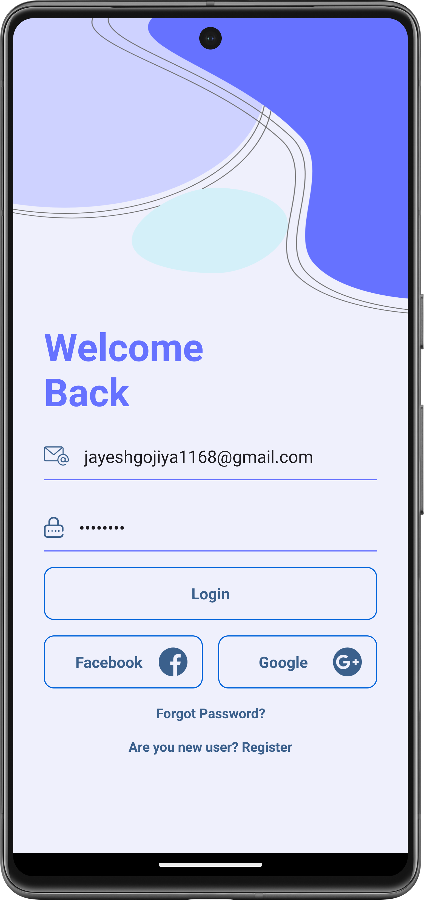
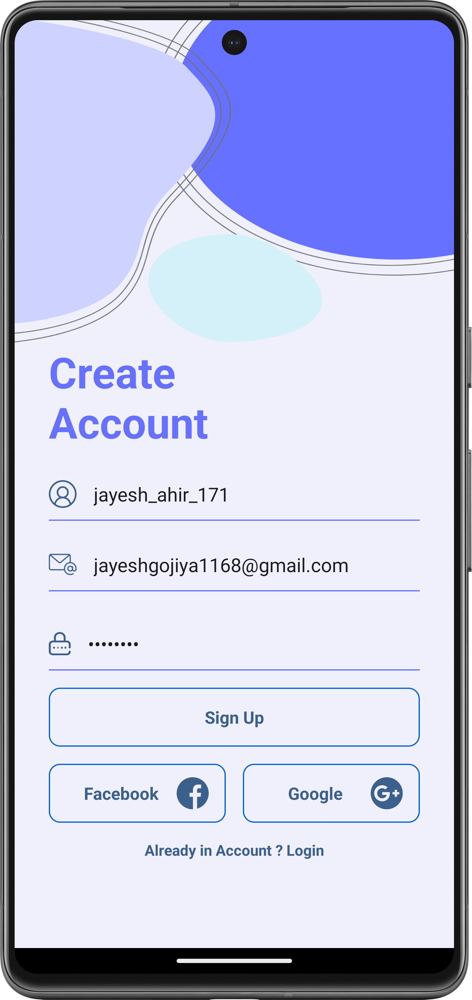
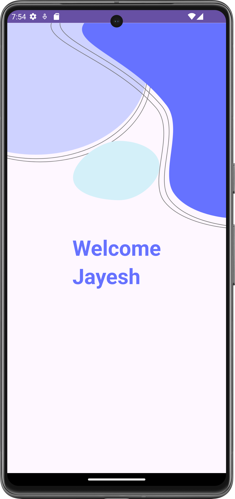

# Awesome Login and Register Android App 🚀

Welcome to our sleek and secure Android application designed to provide hassle-free login and registration experiences. Dive into the world of seamless authentication with our feature-rich app.

## Features

### 1. Login Page 🚪
- Effortless login with email and password.
- Smart validation ensures both email and password fields are filled before attempting to log in.
- Custom toast messages for success or failure, keeping users informed.

### 2. Registration Page 📝
- Register with a unique username, email, and password.
- Secure storage of registration data in our robust SQLite database.

### 3. Database Interaction 💾
- Utilizes the powerful `MyDBHelper` class to handle all database operations.
- The "registers" table in the database includes user ID, username, email, and password columns.

## Project Structure 🏗️

### MainActivity
- Manages login functionality with finesse.
- Methods for toasts, activity changes, and login button click events.

### SignUp Activity
- User-friendly registration process management.
- Validates user input and provides clear feedback on registration success or failure.

### Welcome Activity
- Displays a warm welcome after a successful login.
- Fetches the user's email from `MainActivity` for a personalized touch.

### MyDBHelper
- The brains behind SQLite database operations.
- Includes methods for database creation, user registration, existence checks, and credential validation.

## Getting Started 🚀

1. Clone the repository.
2. Open the project in Android Studio.
3. Run the application on your Android emulator or device.

## Additional Notes 📝

- Consider this project a robust foundation for building a comprehensive authentication system.
- Feel free to customize and expand the app according to your unique requirements.

## Screenshots 📸

  
  
  
  <video width="300"  controls>
    <source src="screenshots/VideoRecording.mp4" type="video/mp4">
  </video>

## Author 🧑‍💻

- **Jayesh Gojiya**
  - LinkedIn: [Jayesh Gojiya](https://www.linkedin.com/in/jayesh-gojiya-6528a22ab/)
  - GitHub: [jayeshgojiya](https://github.com/gojiyajayesh)

If you have any questions, suggestions, or need further assistance, please feel free to reach out. Happy coding! 🌟